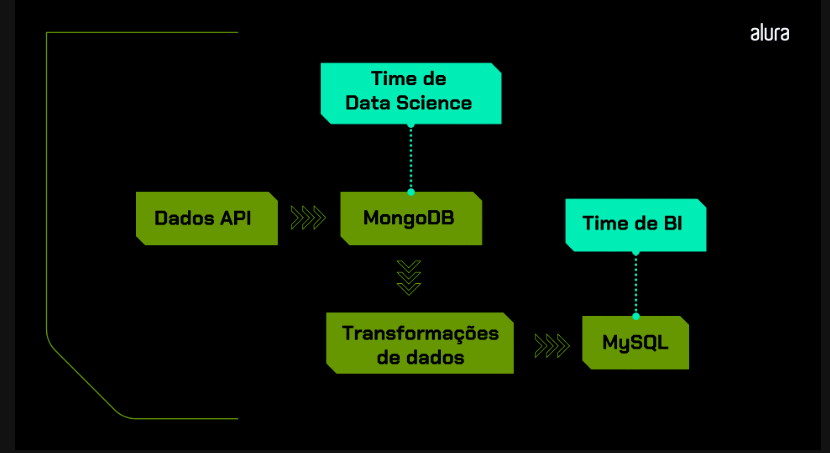

# Pipeline Python - MongoDB - MySQL

Imagine transformar o caos dos dados em insights poderosos. Este projeto é o coração de um pipeline que alimenta decisões estratégicas em uma empresa de e-commerce, conectando tecnologia de ponta com inteligência de negócios.

## Visão Geral do Projeto

Em um cenário em que cada venda gera toneladas de informações, nosso pipeline foi idealizado para extrair, transformar e distribuir dados de forma rápida e confiável. Desenvolvido para lidar com vendas de 2020 a 2023, ele atende tanto a equipes de Data Science quanto de BI, possibilitando análises profundas e relatórios claros.


### O Desafio

Nosso desafio era duplo:
- Capturar grandes volumes de dados de uma API e preservar a integridade dos dados brutos, mantendo-os disponíveis para análises avançadas.
- Converter esses dados em informações estruturadas, prontas para suportar a tomada de decisão através de dashboards e relatórios.

### A Jornada

A arquitetura do pipeline reflete uma jornada que começa com a extração dos dados, passa pelo armazenamento em um sistema NoSQL robusto (MongoDB Atlas) e culmina com a transformação para um formato SQL, ideal para relatórios detalhados. Essa abordagem não só otimiza o fluxo de trabalho, como também garante escalabilidade e flexibilidade.

## Detalhes Técnicos e Benefícios

- **Extração Eficiente:** Conectamos a uma API de produtos, garantindo a captura de todos os dados essenciais.
- **Armazenamento Estratégico:** Dados brutos são preservados no MongoDB, permitindo análises exploratórias e de machine learning.
- **Transformação Inteligente:** Os dados são limpos e estruturados para alimentar o MySQL, fornecendo bases sólidas para dashboards e análise de KPIs.
- **Automação e Sustentabilidade:** Todo o processo é automatizado, promovendo atualizações contínuas e consistentes.

### Por que MongoDB Atlas?

Escolhemos o MongoDB Atlas (versão cloud) por:
- Compatibilidade com WSL (Windows Subsystem for Linux)
- Plano gratuito disponível
- Interface intuitiva
- Fácil configuração e manutenção

### Objetivos do Pipeline

- Fornecer dados brutos para análises complexas (Data Science)
- Disponibilizar dados estruturados para relatórios (BI)
- Automatizar o processo de atualização de dados
- Criar uma solução escalável e manutenível

## Descrição

Este projeto implementa um pipeline de dados que:
1. Extrai dados de produtos de uma API
2. Armazena dados brutos no MongoDB
3. Transforma os dados conforme necessário
4. Gera arquivos CSV para análise

## Pré-requisitos

- Python 3.8+
- MongoDB Atlas conta
- pip (gerenciador de pacotes Python)

## Dependências

O projeto utiliza as seguintes bibliotecas Python:
- requests 2.31.0: Para requisições HTTP à API
- pymongo 4.4.0: Para conexão com MongoDB
- pandas 2.0.3: Para manipulação de dados
- mysql-connector-python 8.0.33: Para conexão com MySQL (futura implementação)
- python-dotenv: Para gerenciamento de variáveis de ambiente
- numpy 1.24.3: Para operações numéricas

## Instalação

1. Clone o repositório
2. Crie um ambiente virtual:
```bash
python -m venv venv
source venv/bin/activate  # Linux/Mac
.\venv\Scripts\activate   # Windows
```
3. Instale as dependências:
```bash
pip install -r requirements.txt
```

## Configuração

### MongoDB Atlas

1. Crie uma conta no [MongoDB Atlas](https://www.mongodb.com/cloud/atlas)
2. Crie um novo cluster (gratuito)
3. Configure o acesso ao banco:
   - Em "Security" > "Database Access", crie um usuário
   - Em "Security" > "Network Access", adicione seu IP
4. Obtenha a string de conexão:
   - Vá para "Databases" > "Connect"
   - Escolha "Connect your application"
   - Copie a string de conexão

### Variáveis de Ambiente

Crie um arquivo `.env` na raiz do projeto com:

```
MONGODB_URI=sua_string_conexao_atlas
MONGODB_DB=db_produtos
API_BASE_URL=https://labdados.com/produtos
```

## Uso

O pipeline consiste em dois scripts principais:

### 1. Extração de Dados (extract_and_save_data.py)
```bash
python scripts/extract_and_save_data.py
```
- Conecta à API
- Extrai dados
- Salva no MongoDB

### 2. Transformação de Dados (transform_data.py)
```bash
python scripts/transform_data.py
```
- Lê dados do MongoDB
- Aplica transformações
- Gera arquivos CSV em /data

## Estrutura do Projeto

```
pipeline-python-mongo-mysql/
├── data/                    # Arquivos CSV gerados, prontos para análise
├── notebooks/               # Notebooks interativos para desenvolvimento e validação
├── scripts/                 # Scripts que orquestram a extração e transformação dos dados
│   ├── extract_and_save_data.py
│   └── transform_data.py
├── requirements.txt         # Lista de dependências do ambiente
└── README.md                # Documentação e narrativa do projeto
```

## Arquivos CSV Gerados

O pipeline gera dois arquivos CSV:
- `data/tabela_livros.csv`: Produtos da categoria livros
- `data/tabela_produtos_2021.csv`: Vendas a partir de 2021

## Contribuição

Sua colaboração pode transformar essa jornada. Siga estes passos:
1. Faça um fork do projeto.
2. Crie sua branch de feature (`git checkout -b feature/AmazingFeature`).
3. Desenvolva, commit suas mudanças (`git commit -m 'Adiciona nova feature'`) e faça push.
4. Abra um Pull Request para revisão.

# Pipeline Python Mongo MySQL

## Overview
Este projeto integra operações com MongoDB e MySQL usando Python para processar dados de produtos. O script `save_data_produtos_2021_mysql.py` lê os dados do arquivo CSV (`../data/tabela_produtos_2021.csv`) e os insere na tabela `tb_produtos_2021` do banco de dados `dbprodutos` no MySQL.

## Requisitos
- Python 3.x
- mysql-connector-python
- pandas

## Setup
1. Instale as dependências:
   ```
   pip install -r requirements.txt
   ```
2. Ajuste as configurações de conexão com o MySQL no script `save_data_produtos_2021_mysql.py`.

## Execução
Para importar os dados para o MySQL, execute:
```
python /home/tmarsbr/pipeline-python-mongo-mysql/notebooks/save_data_produtos_2021_mysql.py
```
